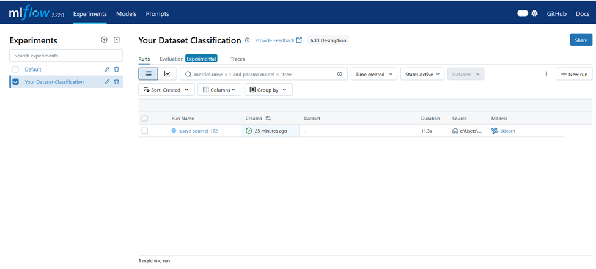
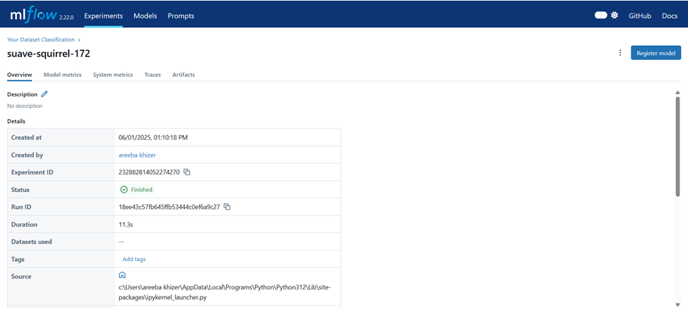
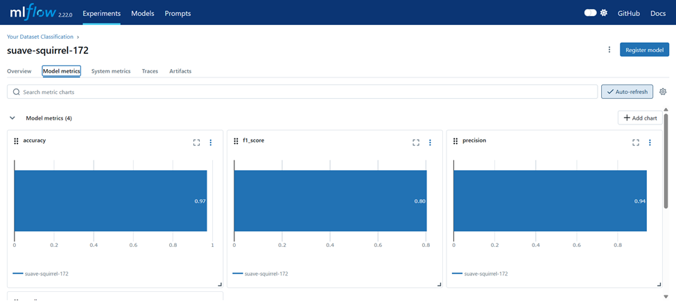

# MLflow Tracking Setup for Diabetes Classification

## Environment Setup

1. **Install dependencies**:
    ```bash
    pip install mlflow scikit-learn pandas
    ```

2. **Start the MLflow Tracking Server** (in terminal):
    ```bash
    mlflow ui
    ```
    - By default, the UI runs at: [http://127.0.0.1:5000](http://127.0.0.1:5000)

---

## Model Training with Tracking

- Trained a `RandomForestClassifier` on a **diabetes dataset**.
- Logged parameters, metrics, and the trained model using MLflow.

### Tracked Items

| Parameter        | Value       |
|------------------|-------------|
| `n_estimators`   | 100         |
| `random_state`   | 42          |

| Metric           | Value (example) |
|------------------|------------------|
| `accuracy`       | 0.97             |
| `precision`      | 0.94             |
| `recall`         | 0.70             |
| `f1_score`       | 0.80             |

---

## Run Information

- **Experiment Name**: `Diabetes Classification`
- **Run ID**: `18ee43c57fb645ffb53444c0ef6a9c27`
- **Model Path**: `runs:/18ee43c57fb645ffb53444c0ef6a9c27/random_forest_classifier`

---

## 🖼️ Screenshot of MLflow UI




---

## Conclusion

MLflow successfully tracked and logged:
- Model parameters
- Evaluation metrics
- The final model artifact

This setup makes it easy to reproduce experiments and deploy the best-performing model.
